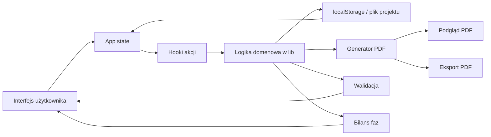

# Architektura aplikacji DINBoard Web

## Cel aplikacji

`DINBoard Web` to desktopowo-webowa aplikacja do projektowania rozdzielnicy, edycji schematu obwodów, budowy listy obwodów, bilansu mocy oraz przygotowania dokumentacji PDF z podglądem i eksportem.

Najważniejszy punkt wejścia to [src/App.tsx](/f:/stare%20pliki/Nowy%20projekt/src/App.tsx:1), który składa cały shell aplikacji i zarządza głównym stanem.

## Główne warstwy

### 1. Shell aplikacji

Warstwa shell odpowiada za:

- górny pasek aplikacji,
- lewy panel,
- środkowy obszar roboczy,
- prawy panel,
- dolny pasek statusu,
- przełączanie arkuszy `sheet1` - `sheet4`.

Najważniejsze pliki:

- [src/App.tsx](/f:/stare%20pliki/Nowy%20projekt/src/App.tsx:1)
- [src/components/AppHeader.tsx](/f:/stare%20pliki/Nowy%20projekt/src/components/AppHeader.tsx:1)
- [src/App.css](/f:/stare%20pliki/Nowy%20projekt/src/App.css:1)

### 2. Stan projektu

Aplikacja trzyma dwa główne zbiory danych:

- `metadata` - dane projektu i dokumentacji PDF,
- `symbols` - elementy elektryczne / moduły w projekcie.

Dodatkowy stan steruje:

- aktywnym arkuszem,
- zaznaczeniem,
- historią undo/redo,
- szyną DIN,
- aktywną zakładką prawego panelu,
- aktywną zakładką dokumentacji PDF.

Najważniejsze typy i normalizacja:

- [src/types/projectMetadata.ts](/f:/stare%20pliki/Nowy%20projekt/src/types/projectMetadata.ts:1)
- [src/types/symbolItem.ts](/f:/stare%20pliki/Nowy%20projekt/src/types/symbolItem.ts:1)
- [src/lib/projectMetadata.ts](/f:/stare%20pliki/Nowy%20projekt/src/lib/projectMetadata.ts:1)

### 3. Hooki sterujące logiką

Logika biznesowa nie siedzi bezpośrednio w `App.tsx`, tylko jest rozbita na wyspecjalizowane hooki:

- `useProjectActions`
  - nowy projekt,
  - otwieranie i zapis,
  - eksport PDF,
  - bilans faz,
  - reset dokumentacji.
- `useSymbolActions`
  - zaznaczanie,
  - drag and drop,
  - edycja elementów,
  - usuwanie,
  - zapis do historii.
- `useSymbolHistory`
  - undo/redo.
- `usePaletteActions`
  - przeciąganie elementów z palety i logika palety.
- `useImportedModules`
  - import SVG i zarządzanie własnymi modułami.

Najważniejsze pliki:

- [src/hooks/useProjectActions.ts](/f:/stare%20pliki/Nowy%20projekt/src/hooks/useProjectActions.ts:1)
- [src/hooks/useSymbolActions.ts](/f:/stare%20pliki/Nowy%20projekt/src/hooks/useSymbolActions.ts:1)
- [src/hooks/useSymbolHistory.ts](/f:/stare%20pliki/Nowy%20projekt/src/hooks/useSymbolHistory.ts:1)
- [src/hooks/usePaletteActions.ts](/f:/stare%20pliki/Nowy%20projekt/src/hooks/usePaletteActions.ts:1)
- [src/hooks/useImportedModules.ts](/f:/stare%20pliki/Nowy%20projekt/src/hooks/useImportedModules.ts:1)

### 4. Widoki robocze

Aplikacja ma 4 główne przestrzenie robocze:

1. `sheet1` - rozdzielnica / szyna DIN
2. `sheet2` - schemat obwodów
3. `sheet3` - lista obwodów
4. `sheet4` - dokumentacja PDF

Najważniejsze komponenty:

- [src/components/DinRailCanvasPixi.tsx](/f:/stare%20pliki/Nowy%20projekt/src/components/DinRailCanvasPixi.tsx:1)
- [src/components/SchematicCanvas.tsx](/f:/stare%20pliki/Nowy%20projekt/src/components/SchematicCanvas.tsx:1)
- [src/components/CircuitListPage.tsx](/f:/stare%20pliki/Nowy%20projekt/src/components/CircuitListPage.tsx:1)
- [src/components/PdfDocumentationPage.tsx](/f:/stare%20pliki/Nowy%20projekt/src/components/PdfDocumentationPage.tsx:1)
- [src/components/PdfPreviewWorkspace.tsx](/f:/stare%20pliki/Nowy%20projekt/src/components/PdfPreviewWorkspace.tsx:1)
- [src/components/MeasurementProtocolsWorkspacePage.tsx](/f:/stare%20pliki/Nowy%20projekt/src/components/MeasurementProtocolsWorkspacePage.tsx:1)

### 5. Usługi i logika domenowa

W folderze `lib` siedzi większość logiki domenowej:

- generowanie PDF,
- walidacja elektryczna,
- kalkulacja bilansu faz,
- budowa listy obwodów,
- eksport snapshotów schematu i DIN,
- katalog modułów i pomocniki aplikacji.

Najważniejsze pliki:

- [src/lib/export/PdfProtocolDocument.tsx](/f:/stare%20pliki/Nowy%20projekt/src/lib/export/PdfProtocolDocument.tsx:1)
- [src/lib/export/pdfExportService.ts](/f:/stare%20pliki/Nowy%20projekt/src/lib/export/pdfExportService.ts:1)
- [src/lib/validation/electricalValidationService.ts](/f:/stare%20pliki/Nowy%20projekt/src/lib/validation/electricalValidationService.ts:1)
- [src/lib/phaseDistribution/phaseDistributionCalculator.ts](/f:/stare%20pliki/Nowy%20projekt/src/lib/phaseDistribution/phaseDistributionCalculator.ts:1)
- [src/lib/circuitRows.ts](/f:/stare%20pliki/Nowy%20projekt/src/lib/circuitRows.ts:1)
- [src/lib/pdfDocumentation.ts](/f:/stare%20pliki/Nowy%20projekt/src/lib/pdfDocumentation.ts:1)
- [src/lib/appHelpers.ts](/f:/stare%20pliki/Nowy%20projekt/src/lib/appHelpers.ts:1)

## Schemat warstw

```mermaid
flowchart TD
    A[App.tsx] --> B[AppHeader]
    A --> C[Left Panel]
    A --> D[Center Workspace]
    A --> E[Right Panel]
    A --> F[Status Bar]

    C --> C1[ProjectPropertiesPage]
    C --> C2[PdfDocumentationPage]
    C --> C3[Palette Browser]

    D --> D1[DinRailCanvas]
    D --> D2[SchematicCanvas]
    D --> D3[CircuitListPage]
    D --> D4[PdfPreviewWorkspace]
    D --> D5[MeasurementProtocolsWorkspacePage]

    E --> E1[PowerBalancePage]
    E --> E2[ValidationPanel]
    E --> E3[CircuitEditPanel]
    E --> E4[PDF tabs / navigation]

    A --> H1[useProjectActions]
    A --> H2[useSymbolActions]
    A --> H3[useSymbolHistory]
    A --> H4[usePaletteActions]
    A --> H5[useImportedModules]

    H1 --> L[lib services]
    H2 --> L
    H3 --> L
    H4 --> L
    H5 --> L
```

## Schemat przepływu danych

## Jak to działa w praktyce

### Rozdzielnica

Użytkownik przeciąga moduły z lewego panelu do obszaru rozdzielnicy. `usePaletteActions` i `useSymbolActions` aktualizują `symbols`, a historia zmian wpada do `useSymbolHistory`.

### Schemat i lista obwodów

Te same `symbols` są wykorzystywane do:

- rysowania schematu,
- budowania listy obwodów przez `buildCircuitRowsFromSymbols`,
- walidacji elektrycznej,
- bilansu faz.

To znaczy, że aplikacja działa na jednym głównym modelu danych, a różne widoki są tylko różnymi projekcjami tego samego stanu.

### Dokumentacja PDF

`sheet4` korzysta z `metadata` oraz `symbols`.

- lewy panel `PdfDocumentationPage` edytuje dane dokumentacji,
- środkowy panel pokazuje preview albo arkusze pomiarowe,
- logika PDF opiera się o `PdfProtocolDocument`,
- eksport końcowy idzie przez `pdfExportService`.

To jest ważne, bo docelowo najlepszy kierunek dla tego obszaru to:

- jedno źródło prawdy dla danych,
- jeden renderer PDF dla preview i eksportu,
- jak najmniej ręcznie dublowanego layoutu HTML obok PDF.

## Najważniejsze zależności architektoniczne

### 1. `App.tsx` jest kompozytorem

`App.tsx` nie powinien być miejscem na ciężką logikę domenową. On powinien:

- trzymać główny state,
- wołać hooki,
- składać layout.

To już jest w dużej mierze zrobione dobrze.

### 2. `symbols` to centrum modelu roboczego

Większość aplikacji kręci się wokół `symbols`. Z nich wynikają:

- schemat,
- lista obwodów,
- bilans,
- walidacja,
- część dokumentacji.

### 3. `metadata` to centrum warstwy dokumentacyjnej

`metadata` steruje:

- danymi projektu,
- danymi strony tytułowej,
- ustawieniami protokołów pomiarowych,
- danymi do eksportu PDF.

### 4. `lib` to serce logiki

Folder `lib` jest właściwą warstwą aplikacyjną. Jeśli chcesz rozwijać projekt spokojnie i bez chaosu, to właśnie tam powinna trafiać większość nowych reguł biznesowych.

## Co w tej architekturze jest mocne

- Jeden główny stan dla projektu.
- Sensowny podział na hooki akcji.
- Dużo logiki już wyciągniętej z komponentów do `lib`.
- Czytelny podział na 4 obszary robocze.
- PDF ma już osobną warstwę generatora.

## Co jest dziś najsłabsze

- `App.tsx` nadal jest duży i pełni rolę głównego orkiestratora prawie wszystkiego.
- Część widoków nadal miesza logikę UI z logiką dokumentu.
- Obszar `sheet4` jest jeszcze w trakcie migracji z Avalonia i ma miejsca, gdzie układ UI oraz przepływ preview nie są jeszcze całkiem domknięte.
- W kilku plikach nadal widać ślady problemów z kodowaniem polskich znaków.

## Moja rekomendacja rozwoju

Jeśli będziesz to dalej porządkował, najlepsza kolejność to:

1. Wydzielić osobny kontener `PdfWorkspaceShell`.
2. Dokończyć unifikację preview i eksportu PDF wokół jednego renderera.
3. Dalej odchudzać `App.tsx` przez wydzielenie kontenerów per arkusz.
4. Uporządkować kodowanie polskich znaków w całym `src`.
5. Spiąć dokumentację architektoniczną z realnymi modułami, żeby łatwiej planować kolejne migracje z Avalonia.

## Szybkie podsumowanie

W uproszczeniu Twoja aplikacja wygląda tak:

- `App.tsx` zarządza układem i globalnym stanem,
- hooki wykonują akcje użytkownika,
- `lib` liczy i przetwarza dane,
- komponenty pokazują różne widoki tego samego projektu,
- `metadata` i `symbols` są dwoma głównymi filarami danych,
- PDF jest osobną warstwą generowania dokumentacji nad tym stanem.
